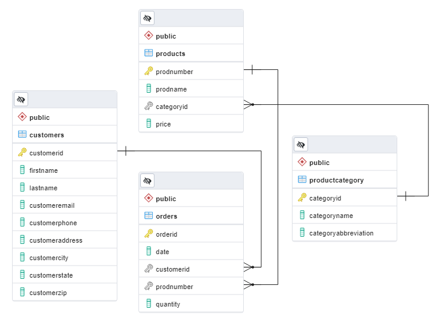

# Digital User Churn Dashboard

In this project, as Business Intelligence Analyst Intern, I was given a task to make a dashboard from raw data and transform and analyze it. There are 4 provided dataset i.e.
1. Customers: Table of the existing customers records.
2. Orders: Table of order history.
3. ProductCategory: Table of product categories list.
4. Products: Table of products list.

## First Step
I'm going to import the dataset to Big Query (transform dataset into .csv is required) and analyze the primary key for each dataset,
1. Customers: CustomerID
2. Orders: OrderID
3. ProductCategory: CategoryID
4. Products: ProdNumber

## Second Step
After that I will need to analyze the foreign key. In Orders dataset there are 2 foreign keys and in Products dataset there is 1 foreign key.
  

    

## Third Step
Before making dashboard I'm going to make master table that consist 8 columns,
* order_date
* category_name
* product_name
* product_price
* order_qty
* total_sales
* cust_email
* cust_city

The query result download [`here`](https://drive.google.com/file/d/1L2iS3ZeVX_u07prhRz4tmZfH3zWprL98/view?usp=sharing)

## Fourth Step
I'm using Looker Studio to make my dashboard to see the dashboard click [`here`](https://lookerstudio.google.com/reporting/c2d05725-e060-4095-a636-77d444e35835)

## Recommendation
* Using cross-selling strategy to boost up the sales revenue by making bundling product such as Robots with Robot Kits, Drones with Drone Kits, eBooks with Training Videos or even company can increase the eBooks price and try to make the highest selling products with the lowest selling products (Robots with eBooks).

* Making customers segmentation based on demographic, geographic and behavioral in order to analyze customers preferences and treatments.

* Promote products by using personal recommendation and sending them to customers email or phone notification based on customers preferences in order to build customers awareness of products and also keeping them from churns.

* Focus on performing marketing campaigns in Washington and Houston to increase sales and performing customer analysis in Monroe, Asheville, Metairie and other low order/sales cities to get better understanding of customers need hence company can make more strategies or products to boost up their loyalty.
